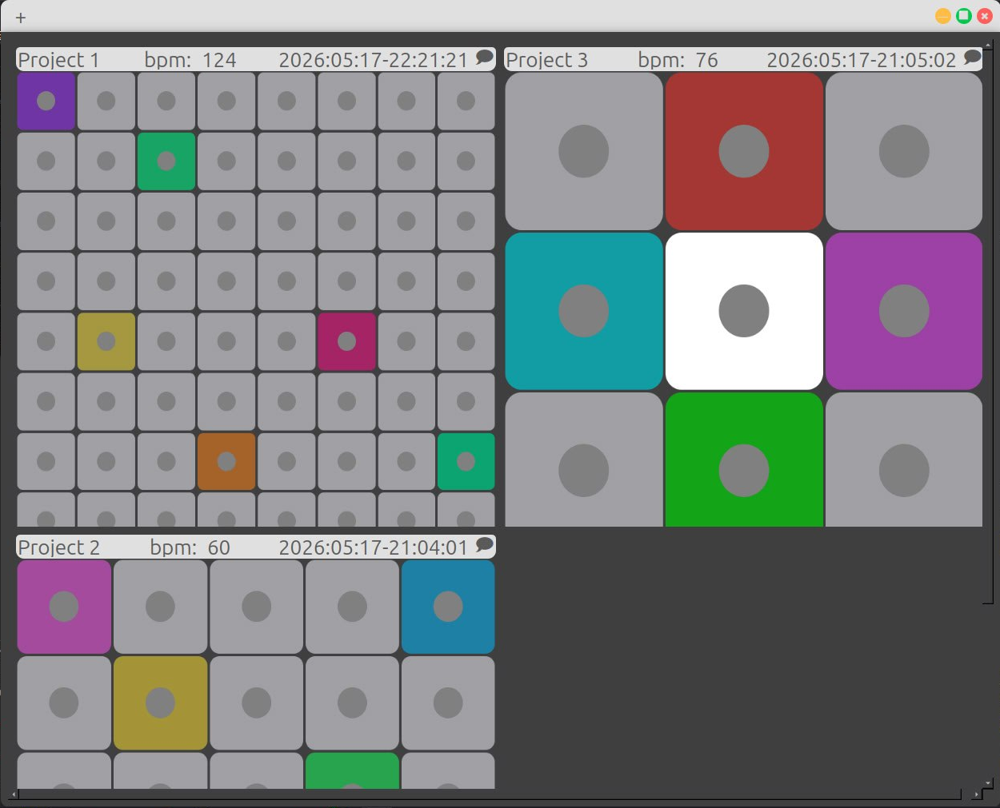
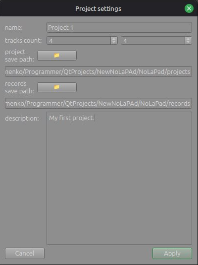
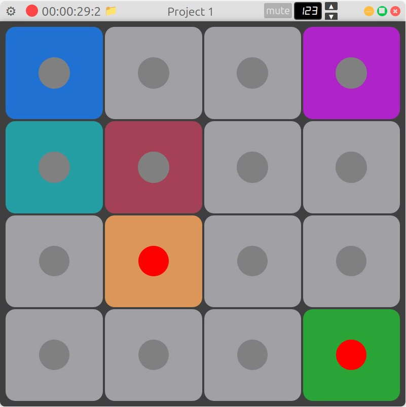
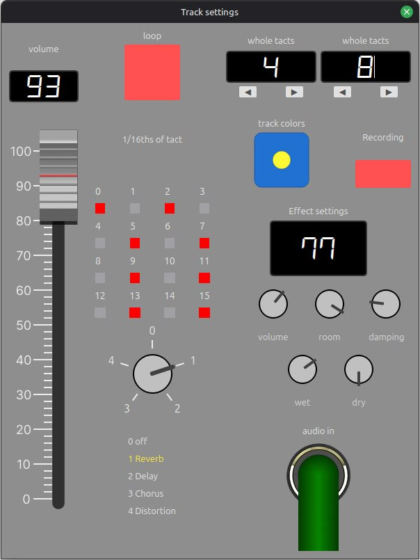

# NoLaPad

**NoLaPad** is a desktop application for playing, editing, and recording music clips through a grid interface (in the style of launchpad controllers), with no need for specialized MIDI hardware and no internet access required.

The project was developed as a bachelor's qualification thesis at the Department of Accounting, Analysis and Audit, National University "Odesa Polytechnic" (specialty 121 "Software Engineering", 2026).

## Features

- **Project management** — create, edit, delete; configure name, tempo, save path, and number of tracks.
- **Grid interface** — simultaneous playback of multiple audio tracks (grid up to 8×8).
- **Track settings** — volume, rhythm, looping, delay, duration, assigning a custom audio sample.
- **Audio effects** — Reverb, Delay, Chorus, Distortion with adjustable parameters.
- **Selective multi-channel recording** of playing tracks.
- **Fully offline** — the app requires no network access and no specialized music hardware.

## Screenshots

**Project manager** — overview of open projects and their track grids.



**Project settings** — configuring name, track grid size, save paths, and description.



**Project view** — a single project's track grid during playback/recording.



**Track settings** — per-track volume, loop pattern, effect type, and effect parameters (Reverb, Delay, Chorus, Distortion).



## Tech stack

| Component | Technology |
|---|---|
| Language | C++17 |
| GUI framework | Qt 6 |
| Audio | JUCE |
| Data serialization | nlohmann/json |
| Build system | CMake + Qt Creator |
| Testing | Qt Test, CTest, gcovr (code coverage) |
| Version control | Git |

## Recomended system requirements

- OS: Linux x64
- CPU: 4 cores, 2.5 GHz or higher
- RAM: 8 GB or more
- Free disk space: 100 GB or more
- Peripherals: mouse or trackpad, monitor, audio output

## Repository structure

```
NoLaPad/
├── CMakeLists.txt
├── src/                    # application source code
├── assets/
│   └── screenshots/         # README screenshots
└── tests/
    ├── CMakeLists.txt
    ├── mocks/              # mock implementations of interfaces (MockAudioEngine, MockStorage, MockTrackPlayer)
    ├── unit/                # unit tests (Qt Test)
    └── integration/         # integration tests
```

> The `src/` directory is illustrative — adjust it to match the actual source layout of your project.

## Building

Dependencies: **CMake** (≥ 3.16), **Qt 6**, **JUCE**, **nlohmann/json**, a compiler with **C++17** support.

```bash
git clone <repository-URL>
cd NoLaPad
mkdir build && cd build
cmake ..
cmake --build .
```

## Testing

The test subproject (`tests/`) is attached to the build via `add_subdirectory(tests)` and contains **81 tests**, split into unit and integration tests, with business logic isolated using mock objects.

```bash
cd build
ctest -v2
```

To generate a code coverage report (Debug build with `--coverage -O0 -g` flags and `gcovr`), use the script:

```bash
./run_tests.sh
```

## Author

**Dmytro Klymenko**, group AS-223
Supervisor: Oleksandr Prygozhev
National University "Odesa Polytechnic", 2026
